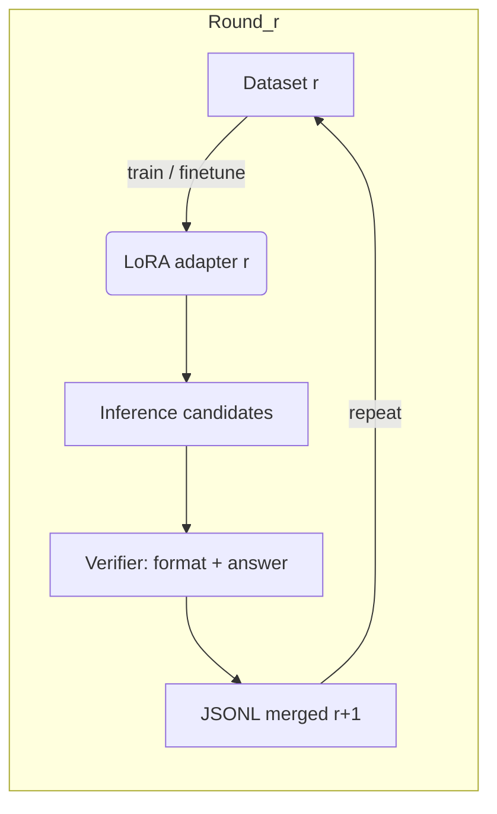

# QT-R1 — STaR × S1 Test-Time Scaling on Qwen2.5-1.5B (Math)

**Summary**  
This repo distills an 11-round STaR loop on **Qwen2.5-1.5B** for math reasoning, influenced by **S1** (Simple Test‑Time Scaling) and using portions of **OpenR1‑Math‑220k**. All runs were executed locally on WSL/Linux across the following sequence: `s2_easy → s2_easy_1 … s2_easy_5 → s2_2_R1_1 … s2_2_R1_5`.  
With **tries=1** and `temperature=0.0`, we observe **~20–30%** accuracy on our selected OpenR1‑Math split (single attempt, strict formatting).

---

## Goals
- **Reproducible data workflow**: Automated multi‑round STaR (generate → verify → merge → finetune), with round‑by‑round traceability.
- **Stable output formatting**: Bound the number of reasoning steps (≤N) and enforce a final line that begins with **`Final:`**; provide a verifier script.
- **S1‑style test‑time compute (optional)**: Although we default to `tries=1` (first‑hit), keep room to extend to multi‑sample voting/selection (BoN, value‑head, judge).
- **Small models can learn**: Show measurable math‑reasoning gains on a **0.5B** model using STaR and modest, clean data.

##  Achievements
- Completed **11 rounds** end‑to‑end: `s2_easy` → `s2_2_R1_5`.
- All rounds run locally on WSL; config is **re‑runnable** via `configs/` + `scripts/pipeline.py`.
- **Format guardian**: `verify_star_integrity_relaxed.py` ensures step count and the last line `Final:` are valid.
- Preliminary accuracy on our OpenR1‑Math split with **tries=1**, `T=0.0`: **~20–30%**.  
  (A fixed test set and full result tables/curves will be added.)

> If you reproduce or improve results, PRs with scorecards are welcome.

---
## Roadmap

###  Done
- 11-round STaR loop (`s2_easy` → `s2_2_R1_5`) on Qwen2.5-1.5B (local WSL).
- Strict format guard (`Final:` + step bound) via `verify_star_integrity_relaxed.py`.
- Single-try inference path (`tries=1`) for fast iteration.

###  In Progress
- Fix a **frozen test split** + `scripts/summarize_reports.py` to auto-aggregate **Accuracy / Format-Pass / Avg Steps** per round into `docs/results.md`.
- Stable Mermaid diagram + CI lint for README rendering.

###  Next (short term)
- **S1-style multi-sample**: support `tries>1` with selection:
  - Best-of-N (majority vote or numeric argmax),
  - **Judge** model / rule-based selector,
  - (optional) **value head** scorer.
- **Base-model swaps**: Qwen2.5-3B / 7B paths with QLoRA; config presets in `configs/`.
- **Evaluation**: add GSM8K / MATH small subsets for sanity checks.

###  Next (mid term)
- **RL track** (plug-in with TRL):
  - DPO/SimPO baseline,
  - **RLAIF** with lightweight reward model (format+correctness),
  - R1-style RL schedule (long-horizon reasoning) with compute caps.
- **Verifier++**:
  - Step-limit heuristics, numeric answer parser, and unit tests.
  - Optional “first-only dataset” export flag.

###  Data & Release
- Provide a small **open sample** (no training leakage) + data schema doc.
- Optional model release: LoRA adapters with clear license & card.

**Contributions welcome**: PRs for selectors (judge/value), RL hooks, new eval sets, or better data curation.


##  Pipeline



- **STaR**: For wrong answers, collect teachable traces by providing the correct answer and regenerating reasoning; finetune on successful samples; iterate.
- **S1 / test‑time compute (optional)**: Support for multi‑sample generation (BoN, step‑wise BoN, judge, self‑refine). This repo defaults to `tries=1` for fast iteration.

---

##  Datasets
- Primary training/evaluation source: selected subsets of **OpenR1‑Math‑220k** (not fully redistributed here; obtain per original license).
- Place your split under `data/`, then set `data.active_path` in `configs/star.yml`.

**Schema (Alpaca‑style, example)**
```json
{"instruction":"Solve the problem with concise steps and end with a single line starting 'Final:'.",
 "input":"(problem text)",
 "output":"(step-by-step ≤N lines)\nFinal: 42"}
```

---

##  Quickstart
```bash
# 1) Install (install torch matching your CUDA separately)
pip install -r requirements.txt

# 2) Smoke test (50 samples, tries=1, deterministic)
python scripts/star_test_100_v3.py   --base-model Qwen/Qwen2.5-1.5B --subset default   --n 50 --seed 63 --max-new-tokens 384 --temperature 0.0   --tries 1 --fewshot format --out-dir outputs/smoke

# 3) Multi-round orchestration (reads configs/star.yml)
python scripts/pipeline.py --config configs/star.yml
```

### Key knobs
- `tries`: **1** (take the first attempt; stop on first hit).  
  For S1‑style multi‑sample testing, set `tries>1` and add a voting/selection step.
- `n`: samples per round (start at **300–600**; smoke test **50–100**).
- `temperature`: `0.0` (stabilizes steps and `Final:`).
- `fewshot`: `format` (format hinting).

---

##  Repo Map
```
QT-R1/
  scripts/
    pipeline.py                      # Orchestrator (test / verify / merge)
    star_test_100_v3.py              # Sampling → generation → Alpaca output
    verify_star_integrity_relaxed.py # Format/step/Final: verifier
    merge_dedup.py                   # Merge + deduplicate
  configs/
    star.yml                         # Global control (rounds, tries, n, ...)
    train_template.yml               # SFT template (plug in your Axolotl cfgs)
  data/    # Your JSONL goes here (keep big files out of git)
  runs/    # LoRA / intermediates (gitignored)
  outputs/ # Reports/artifacts (gitignored)
```

---

##  Repro & Reporting
- Fix a **seed list** (e.g., 63–70) and a **held‑out test split** per round to chart comparable curves.
- Metrics: **Accuracy**, **Format‑Pass** (Final:+step bound), **Avg Steps**, **Timeout%**.
- A table template lives in `docs/results.md`. A future `scripts/summarize_reports.py` can auto‑populate it from round reports.

---

##  References
- **STaR: Bootstrapping Reasoning With Reasoning** — Zelikman et al., 2022.  
  arXiv: https://arxiv.org/abs/2203.14465 ; OpenReview PDF: https://openreview.net/pdf?id=_3ELRdg2sgI
- **s1: Simple Test‑Time Scaling** — Muennighoff et al., 2025.  
  arXiv PDF: https://arxiv.org/pdf/2501.19393
- **DeepSeek‑R1: Incentivizing Reasoning Capability in LLMs via Reinforcement Learning** — DeepSeek‑AI, 2025.  
  arXiv: https://arxiv.org/abs/2501.12948
- **OpenR1‑Math‑220k** — Hugging Face Datasets: https://huggingface.co/datasets/open-r1/OpenR1-Math-220k

> For broader test‑time compute and discriminative sampling (BoN, self‑refine, judge, agent workflows), see o1‑style resources and comparative studies.

---

##  License
MIT


